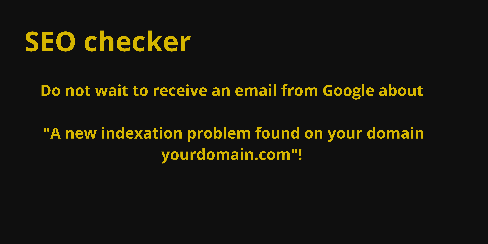

# Google Search Console checker (SEOchecker program)

This tool anticipates Google Search Console errors for SEO.

Run it on your website or the website of your customers to validate the technical SEO.

It shows all errors that Lighthouse does not screen.

Validation features:
- Missing canonicals
- Incorrect canonical URLs
- Broken links (404, 500, ...)
- Sitemap validity
- URL validity in sitemaps

And in the future version:
- Duplicate canonicals
- Basic HTML structure issues (duplicate H1, orphan H2, ...)

## License

MIT: use it for free whenever you want, however you want

## Usage

1) Install Node.js: https://nodejs.org/en/blog/release/v18.12.0
2) Open a terminal
3) Run `npm i -g google-search-console-checker`
4) Run `SEOchecker --all https://yourwebsite.com`

The tool lists anomalies with clear explanations page by page.

Example: `robots.txt is missing on website https://yourwebsite.com`

### Launch Options

- --single: check only the provided page URL
- --all: check recursively all pages from the provided page URL
- --withExternal: check external links
- --help: show this help
- -excludeStatus `<statusCode>`: exclude status responses for checked links
- `<url>`: the URL to check

EXAMPLE: `SEOchecker --single -excludeStatus 401,400 https://example.com/blog/article-1`

## Use it in CI

Stop the push to production process with SEO issues by including this tool in your CI.

If it finds problems, it will return an exit code 1, and the CI process could be interrupted.

## Autor

Thomas Dupont : https://monformateurindependant.com/trainers/thomas-dupont
